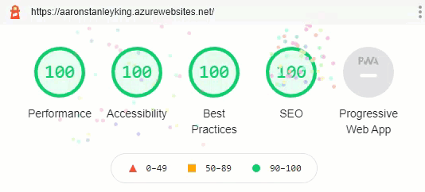

# Aaron Stanley King

### PROD [www.aaronstanleyking.com](https://www.aaronstanleyking.com)  

Currently Blogger

### DEV [aaronstanleyking.azurewebsites.net](https://aaronstanleyking.azurewebsites.net/)  

***
## Project Description  

This is my blog and it written in Node and Express and hosted on [Azure](https://azure.microsoft.com/) or some other host.  I'll compare deployment tools and application performance on several hosts after development.

***Why write custom code to host a blog?***  

Because I wanted to.  It is also where I practice code for the [OpenJS Certification](https://openjsf.org/certification/)

**Goal** 

Create a data driven progressive web application with presentation, analytics, and administration with a 4x100% Lighthouse score.

